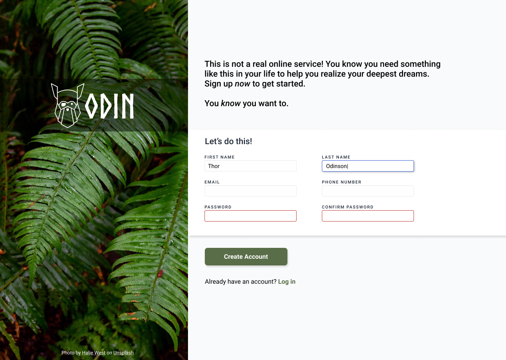

# Sign-up formulary for a restaurant
Olive & Pasta is a remade version of the reference image project of TOP (The Odin Project) restaurant idea for the sig-up formulary, that turn the input blue when you click and write on it, turn the input red when you dont fill correctly the expceted pattern value defined and when you fill everything you can click on the button to access the next page (it have only a message yeat, check out!)

## Used skills
- advanced selectors
- form
- CSS flexbox
- intermediate HTML
- image and logo
- online fonts
- GIT

## Credits
Foto de <a href="https://unsplash.com/pt-br/@keithtanman?utm_source=unsplash&utm_medium=referral&utm_content=creditCopyText">Keith Tanner</a> na <a href="https://unsplash.com/pt-br/fotografias/um-prato-de-espaguete-com-carne-e-legumes-x_2VbXtMChw?utm_source=unsplash&utm_medium=referral&utm_content=creditCopyText">Unsplash</a>
      
## Reference sign-up

## final sign-up page

